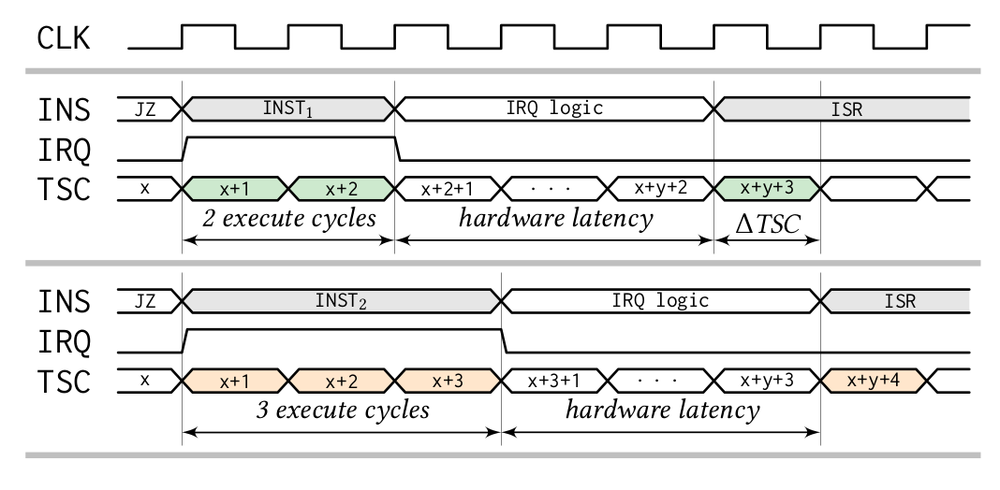
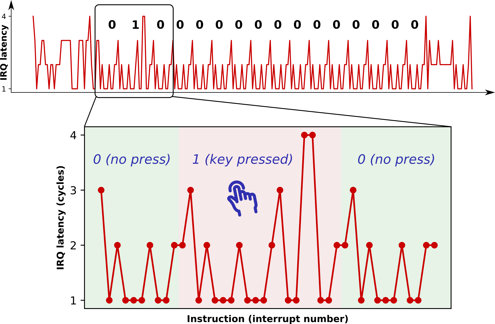

# Nemesis: Studying microarchitectural timing leaks in rudimentary CPU interrupt logic

This repository contains the source code accompanying our
[paper](https://people.cs.kuleuven.be/~jo.vanbulck/ccs18.pdf)
on interrupt timing attacks which appears in the 
25th ACM Conference on Computer and Communications Security (CCS'18).

> Jo Van Bulck, Frank Piessens, and Raoul Strackx. 2018. Nemesis: Studying
> Microarchitectural Timing Leaks in Rudimentary CPU Interrupt Logic. In
> Proceedings of the 25th ACM Conference on Computer and Communications
> Security (CCS'18).

## Abstract

Recent research on transient execution vulnerabilities shows that current
processors exceed our levels of understanding. The prominent Meltdown and
Spectre attacks abruptly revealed fundamental design flaws in CPU pipeline
behavior and exception handling logic, urging the research community to
systematically study attack surface from microarchitectural interactions.

We present Nemesis, a previously overlooked side-channel attack vector that
abuses the CPU's interrupt mechanism to leak microarchitectural instruction
timings from enclaved execution environments such as Intel SGX, Sancus, and
TrustLite. At its core, Nemesis abuses the same subtle microarchitectural
behavior that enables Meltdown, i.e., exceptions and interrupts are delayed
until instruction retirement. We show that by measuring the latency of a
carefully timed interrupt, an attacker controlling the system software is able
to infer instruction-granular execution state from hardware-enforced enclaves.
In contrast to speculative execution vulnerabilities, our novel attack vector
is applicable to the whole computing spectrum, from small embedded sensor nodes
to high-end commodity x86 hardware. We present practical interrupt timing
attacks against the open-source Sancus embedded research processor, and we show
that interrupt latency reveals microarchitectural instruction timings from
off-the-shelf Intel SGX enclaves. Finally, we discuss challenges for
mitigating Nemesis-type attacks at the hardware and software levels.

## Source code overview 

We evaluated interrupt timing attacks on two case study platforms.

- **Sancus:** this directory contains source code for the secure keypad and BSL
  applications scenarios plus corresponding attacker code. Note that the secure
  interrupt architectural extensions we implemented for this work have been
  upstreamed to the open-source
  [sancus-core](https://github.com/sancus-tee/sancus-core) and
  [sancus-compiler](https://github.com/sancus-tee/sancus-compiler) repositories.

- **Intel SGX:** this directory contains source code for the microbenchmarks,
  binary search, and Zigzagger enclave evaluation scenarios plus corresponding
  attacker code and post-processing scripts. Note that the single-stepping
  framework enhancements we developed for this work have been upstreamed to the
  open-source [SGX-Step](https://github.com/jovanbulck/sgx-step) repository.

## License

All Nemesis code is free software, licensed under
[GPLv3](https://www.gnu.org/licenses/gpl-3.0).
